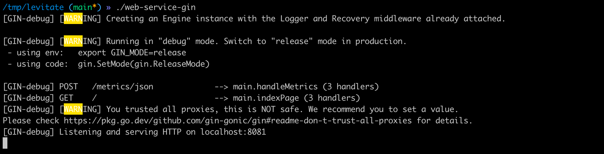
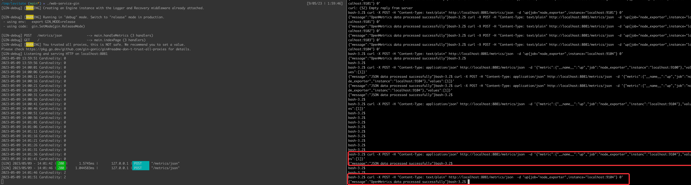
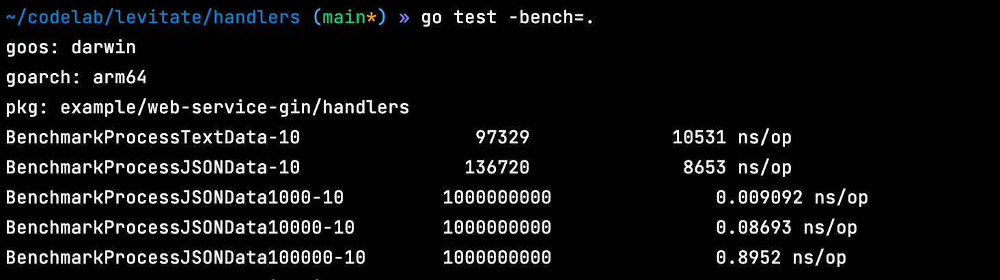

## Instructions to Run

Install the binary using

```go get github.com/sridhargude/levitate.git@latest```

Build the Binary:

```go build```

Once the binary is built successfully, run the binary: 

``` levitate ```

It runs on port localhost:8081



Access the ip:port to check if the services is running and POST Metrics:


Cardinality is printed every 5 seconds

## Framework:

Gin - HTTP Webservice


### Design Considerations:
   1. Cardinality is calculated every 5 seconds, need to consider what frequency do we receive the metrics from system .
      If the metrics are received every 5 seconds we are calculating the Cardinality number that can be better 
      represented in the next run.
   2. Data Structure to count the distinct metrics

      HyperLogLog and Count-Min Sketch are more suitable for cardinality estimation and frequency tracking, 
      while Bloom Filters excel in membership testing with a compact memory footprint.

      #### HyperLogLog:

      Space Efficiency: HyperLogLog is highly space-efficient compared to other data structures. 
      It can estimate the cardinality of a set with a small memory footprint.

      Estimation Accuracy: The accuracy of HyperLogLog improves with more memory allocation. 
      However, there is always some inherent estimation error, which is typically within a few percentage points.

      Limited Operations: HyperLogLog is primarily designed for estimating distinct elements. 
      It does not support other set operations like insertion, deletion, or membership testing.

      #### Count-Min Sketch:

      Space Efficiency: Count-Min Sketch is generally more space-efficient than HyperLogLog when estimating the 
      frequency of elements. It can provide approximate counts using a smaller memory footprint.

      Frequency Estimation: Count-Min Sketch allows estimating the frequency of elements, not just the distinct elements. 
      It is useful when you need to track the occurrence count of elements in addition to estimating cardinality.

      More Memory Usage: Count-Min Sketch typically requires more memory than HyperLogLog to achieve similar estimation 
      accuracy for cardinality estimation.
      
      I choose HLL since we are interested here in Cardinality and Space Efficiency over support for features like 
      extra operations and frequency estimation that Count-Min Sketch provides.

   3. Buffered Channel vs Unbuffered Channel
      Since the size of the buffer depends on various factors like the size of the requests coming in and processing 
      rate (i.e., consumption) and calculating the cardinality of each record, also it depends on system resources 
      available, I choose unbuffered. But the ideal way is to use some kind of MQ in between and consume them.


### BenchMark




## Reference
1. https://engineering.fb.com/2018/12/13/data-infrastructure/hyperloglog/


